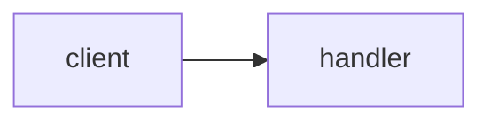

# explain-pr + explain-plan Skills Implementation Plan

> **For agentic workers:** REQUIRED SUB-SKILL: Use superpowers:subagent-driven-development (recommended) or superpowers:executing-plans to implement this plan task-by-task. Steps use checkbox (`- [ ]`) syntax for tracking.

**Goal:** Two personal Claude Code skills that explain agent-written PRs and agent plans as ADHD-friendly visual HTML pages, accumulating a per-repo orientation guide.

**Architecture:** Each skill is a directory under `~/.claude/skills/` containing a SKILL.md (workflow instructions) and a template.html (fixed page structure, filled via `{{TOKEN}}` replacement). Both skills share repo-guide conventions (duplicated in each SKILL.md; skills cannot share includes). The guide lives at `~/.claude/repo-guides/<repo-key>.md`, keyed by repo identity so all worktrees and clones share one guide.

**Tech Stack:** Markdown skill files, self-contained HTML/CSS (artifact CSP: no external resources), mermaid via `<pre class="mermaid">` (artifacts render natively), bash for git/gh interrogation.

**Spec:** `~/.claude/skills/docs/specs/2026-08-18-explain-pr-plan-skills-design.md`

## Global Constraints

- NO emdashes in any created file. Use `-` or `--`.
- `~/.claude` is NOT a git repo: there are no commit steps in this plan.
- Explanation style rules (baked into both SKILL.md files, copied verbatim from spec): mechanism never category; name the real thing; gloss every term on first use; max 2 sentences per bullet; banned words: leverage, robust, seamless, holistic, paradigm, surface area, first-class, ergonomics, opinionated, orchestrate, architected, non-trivial.
- Section order in templates is invariant and must never be rearranged by a fill.
- Templates must be self-contained: inline CSS/JS only, no external fonts/scripts/images.
- Theme: light tokens on bare `:root`; dark redefined under `@media (prefers-color-scheme: dark)` guarded as `:root:not([data-theme="light"])` AND again under `:root[data-theme="dark"]`. `body` gets an explicit token background.
- Verified repo-key derivation snippet (tested 2026-08-18 against a main checkout, a linked worktree, and an origin remote; all worktrees resolve identically):

```bash
origin=$(git remote get-url origin 2>/dev/null)
if [ -n "$origin" ]; then
  key=$(printf '%s' "$origin" | sed -E 's#^[a-z]+://##; s#^git@##; s#\.git$##; s#[^A-Za-z0-9]+#-#g' | tr 'A-Z' 'a-z')
else
  key=$(basename "$(dirname "$(git rev-parse --path-format=absolute --git-common-dir)")")
fi
echo "$key"
```

---

### Task 1: explain-pr SKILL.md

**Files:**
- Create: `~/.claude/skills/explain-pr/SKILL.md`

**Interfaces:**
- Produces: repo-guide file format and repo-key snippet that Task 2 duplicates verbatim; template token names `{{TITLE}}`, `{{TLDR_HTML}}`, `{{FLOW_MERMAID}}`, `{{COMPONENT_COUNT}}`, `{{COMPONENT_ITEMS}}`, `{{CHECK_COUNT}}`, `{{CHECK_ITEMS}}`, `{{GLOSSARY_ITEMS}}` that Task 3's explain-pr template must define.

- [ ] **Step 1: Create the skill directory and write SKILL.md with exactly this content**

`mkdir -p ~/.claude/skills/explain-pr`

`````markdown
---
name: explain-pr
description: Explain what a PR, branch, or working-tree diff actually does, written for a reader who barely knows the repo. Produces a visual HTML page (process map, component breakdown, manual checks, glossary) and updates the per-repo orientation guide. Use when the user asks "what does this PR do", wants a diff or agent-written change explained, or invokes /explain-pr.
---

# Explain PR

Explain someone else's change to a reader who has ZERO knowledge of this repo but is a competent engineer. This is understanding, not judgment: do not review, praise, or criticize the code. Explain it.

## Style rules (hard requirements for every sentence you output)

- Mechanism, never category. NOT "it uses a caching strategy". YES "it holds the result in memory for 60s, so the second call skips the DB".
- Name the real thing: file, function, value, error. NOT "the retry logic is unbounded". YES "`fetchUser` never resets `attempts`".
- Gloss every repo-specific or advanced term on first use: "idempotent (running it twice does the same as once)". Each glossed term also becomes a Glossary entry.
- Max 2 sentences per bullet.
- Banned words unless quoting code: leverage, robust, seamless, holistic, paradigm, surface area, first-class, ergonomics, opinionated, orchestrate, architected, non-trivial.

## Step 0 - Repo key and guide

Derive the repo key. It identifies the REPO, not the checkout, so every worktree and clone shares one guide:

```bash
origin=$(git remote get-url origin 2>/dev/null)
if [ -n "$origin" ]; then
  key=$(printf '%s' "$origin" | sed -E 's#^[a-z]+://##; s#^git@##; s#\.git$##; s#[^A-Za-z0-9]+#-#g' | tr 'A-Z' 'a-z')
else
  key=$(basename "$(dirname "$(git rev-parse --path-format=absolute --git-common-dir)")")
fi
echo "$key"
```

If not inside a git repo: tell the user and STOP.

Read `~/.claude/repo-guides/<key>.md` if it exists.
- A component entry is FRESH if `git log -1 --format=%H -- <path>` equals the entry's Stamp hash. Reuse fresh entries without re-deriving them.
- A stale entry (hashes differ) must be re-derived from the current file in Step 2.
- If the guide exists but is unparseable (no `## Components` heading, or truncated mid-entry): rename it to `<key>.md.bak`, start a fresh guide, and tell the user you did so.

## Step 1 - Acquire the diff

Try in order, stop at the first that returns content:

1. PR number or URL given: `gh pr diff <n>`. If `gh` fails (missing, unauthenticated), say so in one line and continue down the ladder.
2. Branch: `default=$(git symbolic-ref --short refs/remotes/origin/HEAD 2>/dev/null | sed 's#^origin/##'); git diff ${default:-main}...HEAD`
3. Working tree: `git diff HEAD`

If all are empty: state "No changes found" and STOP.

## Step 2 - Deep read

- Read every touched file IN FULL. NEVER explain a hunk in isolation.
- For every changed or new function/class, grep the repo for its callers. Blast radius = who calls this and what happens to them if it misbehaves.
- Collect every repo-specific term you had to figure out while reading; they become Glossary entries.
- Reuse fresh guide entries for context instead of re-deriving known components.

## Step 3 - Build the explanation

Produce these five pieces, obeying the style rules:

1. **TL;DR**: what this PR does, max 3 sentences, plain language.
2. **Flow diagram**: mermaid `flowchart LR` of the affected path. Unchanged steps get `class ... dim`, new or modified steps get `class ... hot`. Include both classDefs:
   `classDef dim fill:#e5e7eb,stroke:#9ca3af,color:#4b5563` and `classDef hot fill:#dbeafe,stroke:#2563eb,color:#1e3a8a,stroke-width:2px`.
   If the change has no meaningful flow (pure config, docs), diagram the smallest surrounding process it affects.
3. **Component breakdown**: one entry per touched file with exactly these four bullets: What it is / Why it exists / What this change does to it / If this change is wrong, what breaks. Assign a severity badge: red (data loss, auth, money, migrations), amber (user-visible behavior), green (internal, low blast radius). Mark newly created files with a NEW badge.
4. **Check this yourself**: 2-4 concrete manual verifications with exact commands or URLs and the expected observable result. These must come from THIS diff's risks, not a generic checklist.
5. **Glossary**: every term you glossed, defined in one sentence each.

## Step 4 - Render the page

Read `template.html` from this skill's directory. Replace every `{{TOKEN}}`; change NOTHING else (no restructuring, no CSS edits, no section reordering - consistency across runs is the point).

| Token | Content |
|---|---|
| `{{TITLE}}` | `<repo-key> PR <n>` or `<repo-key> <branch>` |
| `{{TLDR_HTML}}` | up to 3 `<p>` sentences |
| `{{FLOW_MERMAID}}` | the mermaid source from Step 3.2 |
| `{{COMPONENT_COUNT}}` | number of component entries |
| `{{COMPONENT_ITEMS}}` | one `<details>` block per file, shape below |
| `{{CHECK_COUNT}}` | number of check items |
| `{{CHECK_ITEMS}}` | one `.check` div per item, shape below |
| `{{GLOSSARY_ITEMS}}` | `<dt>term</dt><dd>definition</dd>` pairs |

Component `<details>` shape:

```html
<details>
  <summary><code>src/middleware/rate_limiter.ts</code> <span class="badge new">NEW</span> <span class="badge amber">medium</span> counts requests per IP</summary>
  <ul>
    <li><strong>What it is:</strong> ...</li>
    <li><strong>Why it exists:</strong> ...</li>
    <li><strong>What this change does:</strong> ...</li>
    <li><strong>If this is wrong:</strong> ...</li>
  </ul>
</details>
```

Check item shape:

```html
<div class="check"><input type="checkbox"><div>
  <strong>Rate limit actually triggers</strong><button class="copy">copy</button>
  <pre>for i in $(seq 1 30); do curl -s -o /dev/null -w "%{http_code}\n" localhost:3000/api/users; done</pre>
  <p>Expect 429 responses after request 20.</p>
</div></div>
```

Write the filled HTML to the scratchpad, then publish with the Artifact tool: favicon `🔍` (never change it), title from `{{TITLE}}`. If the Artifact tool is unavailable, write the file to `~/.claude/repo-guides/renders/<key>-<title-slug>.html` and send it with SendUserFile (display: render).

## Step 5 - Update the guide

RE-READ `~/.claude/repo-guides/<key>.md` from disk NOW - an agent in another worktree may have written it since Step 0. Merge: keep entries you did not touch, replace entries you refreshed, append new ones. Then write the whole file.

- Every component you explained gets an entry stamped with `git log -1 --format=%H -- <path>` and today's date.
- Add new glossary terms (skip duplicates).
- Add or update the flow diagram you drew, under a stable name (e.g. "api request path").
- If `## Overview` is missing or empty, write it now: what the app does, max 5 sentences.

Guide file format:

````markdown
# Repo guide: <key>

Maintained by the explain-pr and explain-plan skills. This is a cache of understanding; the code is the truth.

Updated: YYYY-MM-DD

## Overview

<max 5 sentences>

## Components

### path/to/file.ts
- What: <one sentence>
- Why it exists: <one sentence>
- Gotchas: <optional, max 2 sentences>
- Stamp: <full commit hash> YYYY-MM-DD

## Flows

### <flow name>


## Glossary

- **term**: one-sentence definition
````

Finish your reply to the user with the artifact link and one line noting the guide was updated.
`````

- [ ] **Step 2: Verify frontmatter parses and the file is complete**

Run: `head -5 ~/.claude/skills/explain-pr/SKILL.md && grep -c '^## Step' ~/.claude/skills/explain-pr/SKILL.md`
Expected: frontmatter with `name: explain-pr`, and step count `6` (Steps 0-5).

---

### Task 2: explain-plan SKILL.md

**Files:**
- Create: `~/.claude/skills/explain-plan/SKILL.md`

**Interfaces:**
- Consumes: repo-key snippet and guide format from Task 1, duplicated verbatim (Step 0 and Step 5 below are word-for-word identical to explain-pr's except the skill name in the guide header comment).
- Produces: template token names `{{TITLE}}`, `{{TLDR_HTML}}`, `{{PLAN_MERMAID}}`, `{{MAP_ITEMS}}`, `{{RISK_COUNT}}`, `{{RISK_ITEMS}}`, `{{QUESTION_ITEMS}}`, `{{GLOSSARY_ITEMS}}` that Task 3's explain-plan template must define.

- [ ] **Step 1: Create the skill directory and write SKILL.md with exactly this content**

`mkdir -p ~/.claude/skills/explain-plan`

`````markdown
---
name: explain-plan
description: Map an agent's implementation plan to the actual code it references so the user can judge the plan instead of rubber-stamping it. Produces a visual HTML page (plan-to-code map, risk flags, questions to ask the agent) and updates the per-repo orientation guide. Use when the user asks to explain, check, or sanity-check an agent's plan, or invokes /explain-plan.
---

# Explain Plan

An agent proposed a plan; the user cannot judge it because they do not know the code it references. Your job: establish what the referenced code does TODAY, compare that against what the plan claims, and surface where the plan is an assumption rather than a fact. Do not rewrite or improve the plan.

## Style rules (hard requirements for every sentence you output)

- Mechanism, never category. NOT "it uses a caching strategy". YES "it holds the result in memory for 60s, so the second call skips the DB".
- Name the real thing: file, function, value, error. NOT "the retry logic is unbounded". YES "`fetchUser` never resets `attempts`".
- Gloss every repo-specific or advanced term on first use: "idempotent (running it twice does the same as once)". Each glossed term also becomes a Glossary entry.
- Max 2 sentences per bullet.
- Banned words unless quoting code: leverage, robust, seamless, holistic, paradigm, surface area, first-class, ergonomics, opinionated, orchestrate, architected, non-trivial.

## Step 0 - Repo key and guide

Derive the repo key. It identifies the REPO, not the checkout, so every worktree and clone shares one guide:

```bash
origin=$(git remote get-url origin 2>/dev/null)
if [ -n "$origin" ]; then
  key=$(printf '%s' "$origin" | sed -E 's#^[a-z]+://##; s#^git@##; s#\.git$##; s#[^A-Za-z0-9]+#-#g' | tr 'A-Z' 'a-z')
else
  key=$(basename "$(dirname "$(git rev-parse --path-format=absolute --git-common-dir)")")
fi
echo "$key"
```

If not inside a git repo: tell the user and STOP.

Read `~/.claude/repo-guides/<key>.md` if it exists.
- A component entry is FRESH if `git log -1 --format=%H -- <path>` equals the entry's Stamp hash. Reuse fresh entries without re-deriving them.
- A stale entry (hashes differ) must be re-derived from the current file in Step 2.
- If the guide exists but is unparseable (no `## Components` heading, or truncated mid-entry): rename it to `<key>.md.bak`, start a fresh guide, and tell the user you did so.

## Step 1 - Acquire the plan

Try in order:

1. An argument that is a file path: Read it.
2. Plan text pasted in the user's message: use it.
3. A plan presented earlier in this conversation (by you or another agent): use the most recent one.

If none found: ask the user to paste the plan or give a path, and STOP until they do.

## Step 2 - Map each plan step to code

For every step in the plan:

- Extract the files, functions, classes, endpoints, and tables it names or implies. Grep for each; read the surrounding file IN FULL.
- Record what that code does TODAY, before the plan changes it.
- If a referenced thing does not exist in the repo, that is a MISSING risk flag (Step 3), not an error.
- Reuse fresh guide entries for context instead of re-deriving known components.

## Step 3 - Flag risks

Compare plan claims against code reality. Flag every instance of:

- **MISMATCH** (red): the plan says the code does X; it actually does Y. Quote both the plan line and the code.
- **MISSING** (red): the plan references a file, function, or table that does not exist.
- **IRREVERSIBLE** (red): DB migrations, data deletion, published API contract changes.
- **UNKNOWN** (amber): the step depends on an external API or library behavior that nothing in the repo currently exercises. These are spike candidates: the smallest throwaway script that would prove the assumption.
- **UNTESTED** (amber): the step adds or changes logic with no corresponding test step in the plan.

Then derive **Questions to ask the agent**: 2-3 concrete challenges from the highest-severity flags, phrased so the user can paste them straight back to the agent (e.g. "You say `SessionStore.get` returns null on expiry - it actually throws `TokenExpiredError` (session.ts:88). How does step 3 handle that?").

## Step 4 - Render the page

Read `template.html` from this skill's directory. Replace every `{{TOKEN}}`; change NOTHING else (no restructuring, no CSS edits, no section reordering - consistency across runs is the point).

| Token | Content |
|---|---|
| `{{TITLE}}` | `<repo-key> plan: <short plan topic>` |
| `{{TLDR_HTML}}` | up to 3 `<p>` sentences: what the plan builds and your one-line verdict on how grounded it is |
| `{{PLAN_MERMAID}}` | mermaid `flowchart LR` of plan steps pointing at the files they touch; steps with red flags get `class ... hot`, clean steps `class ... dim`. Include both classDefs: `classDef dim fill:#e5e7eb,stroke:#9ca3af,color:#4b5563` and `classDef hot fill:#dbeafe,stroke:#2563eb,color:#1e3a8a,stroke-width:2px` |
| `{{MAP_ITEMS}}` | one `<details>` block per plan step, shape below |
| `{{RISK_COUNT}}` | number of risk flags |
| `{{RISK_ITEMS}}` | one `<details>` block per flag, shape below |
| `{{QUESTION_ITEMS}}` | `<li>` per question |
| `{{GLOSSARY_ITEMS}}` | `<dt>term</dt><dd>definition</dd>` pairs |

Map item shape:

```html
<details>
  <summary>Step 2: add rate limiting <span class="badge amber">1 flag</span> touches <code>src/middleware/</code></summary>
  <ul>
    <li><strong>Code it touches:</strong> ...</li>
    <li><strong>What that code does today:</strong> ...</li>
    <li><strong>What this step changes:</strong> ...</li>
  </ul>
</details>
```

Risk item shape:

```html
<details>
  <summary><span class="badge red">MISMATCH</span> plan misreads <code>SessionStore.get</code></summary>
  <ul>
    <li><strong>Plan says:</strong> "returns null on expiry"</li>
    <li><strong>Code says:</strong> throws <code>TokenExpiredError</code> (session.ts:88)</li>
    <li><strong>Why it matters:</strong> step 3's null check will never run; expired sessions crash the handler.</li>
  </ul>
</details>
```

Write the filled HTML to the scratchpad, then publish with the Artifact tool: favicon `🗺️` (never change it), title from `{{TITLE}}`. If the Artifact tool is unavailable, write the file to `~/.claude/repo-guides/renders/<key>-<title-slug>.html` and send it with SendUserFile (display: render).

## Step 5 - Update the guide

RE-READ `~/.claude/repo-guides/<key>.md` from disk NOW - an agent in another worktree may have written it since Step 0. Merge: keep entries you did not touch, replace entries you refreshed, append new ones. Then write the whole file.

- Every component you explained gets an entry stamped with `git log -1 --format=%H -- <path>` and today's date.
- Add new glossary terms (skip duplicates).
- If `## Overview` is missing or empty, write it now: what the app does, max 5 sentences.

Guide file format:

````markdown
# Repo guide: <key>

Maintained by the explain-pr and explain-plan skills. This is a cache of understanding; the code is the truth.

Updated: YYYY-MM-DD

## Overview

<max 5 sentences>

## Components

### path/to/file.ts
- What: <one sentence>
- Why it exists: <one sentence>
- Gotchas: <optional, max 2 sentences>
- Stamp: <full commit hash> YYYY-MM-DD

## Flows

### <flow name>


## Glossary

- **term**: one-sentence definition
````

Finish your reply to the user with the artifact link, the risk count, and one line noting the guide was updated.
`````

- [ ] **Step 2: Verify frontmatter parses and Step 0/5 match explain-pr's**

Run: `head -5 ~/.claude/skills/explain-plan/SKILL.md && diff <(sed -n '/^## Step 0/,/^## Step 1/p' ~/.claude/skills/explain-pr/SKILL.md) <(sed -n '/^## Step 0/,/^## Step 1/p' ~/.claude/skills/explain-plan/SKILL.md)`
Expected: frontmatter with `name: explain-plan`; diff output empty (Step 0 identical in both).

---

### Task 3: Both template.html files + impeccable pass

**Files:**
- Create: `~/.claude/skills/explain-pr/template.html`
- Create: `~/.claude/skills/explain-plan/template.html`

**Interfaces:**
- Consumes: token names from Tasks 1 and 2 (must match exactly: a token in a SKILL.md fill table that does not exist in its template is a bug).
- Produces: the fixed page structures every future run fills.

- [ ] **Step 1: Write `~/.claude/skills/explain-pr/template.html` with exactly this content**

```html
<title>{{TITLE}}</title>
<!-- Fixed template for the explain-pr skill. Fill {{TOKEN}} markers only. Never restructure. -->
<style>
:root{
  --bg:#f6f6f4;--card:#ffffff;--ink:#191919;--muted:#66665f;--line:#e3e3dd;
  --accent:#2563eb;--accent-soft:#dbeafe;
  --red:#b91c1c;--red-soft:#fde8e8;--amber:#92400e;--amber-soft:#fdf0d2;
  --green:#166534;--green-soft:#ddf3e4;
}
@media (prefers-color-scheme:dark){
  :root:not([data-theme="light"]){
    --bg:#121316;--card:#1c1e22;--ink:#e9e9e6;--muted:#9b9b95;--line:#2b2e34;
    --accent:#7aa7ff;--accent-soft:#22304d;
    --red:#f08585;--red-soft:#3c2222;--amber:#e8b45a;--amber-soft:#3a2f16;
    --green:#7ed09a;--green-soft:#1d3527;
  }
}
:root[data-theme="dark"]{
  --bg:#121316;--card:#1c1e22;--ink:#e9e9e6;--muted:#9b9b95;--line:#2b2e34;
  --accent:#7aa7ff;--accent-soft:#22304d;
  --red:#f08585;--red-soft:#3c2222;--amber:#e8b45a;--amber-soft:#3a2f16;
  --green:#7ed09a;--green-soft:#1d3527;
}
body{background:var(--bg);color:var(--ink);font:16px/1.55 system-ui,sans-serif;margin:0;padding-bottom:4rem}
main{max-width:760px;margin:0 auto;padding:0 1rem}
nav{position:sticky;top:0;background:var(--bg);border-bottom:1px solid var(--line);display:flex;gap:1rem;padding:.65rem 1rem;font-size:.9rem;z-index:9;overflow-x:auto}
nav a{color:var(--muted);text-decoration:none;white-space:nowrap}
nav a strong{color:var(--ink)}
h1{font-size:1.3rem;margin:1.4rem 0 .2rem}
h2{font-size:1.15rem;margin:2.2rem 0 .8rem}
.card{background:var(--card);border:1px solid var(--line);border-radius:10px;padding:1rem 1.2rem}
#tldr .card{border-left:4px solid var(--accent)}
#tldr p{margin:.3rem 0;font-size:1.05rem}
details{background:var(--card);border:1px solid var(--line);border-radius:10px;margin:.5rem 0;padding:.2rem .9rem}
details[open]{padding-bottom:.8rem}
summary{cursor:pointer;padding:.6rem 0;font-weight:600;display:flex;gap:.6rem;align-items:center;flex-wrap:wrap}
.badge{font-size:.72rem;font-weight:700;padding:.15rem .5rem;border-radius:99px;letter-spacing:.02em}
.badge.red{background:var(--red-soft);color:var(--red)}
.badge.amber{background:var(--amber-soft);color:var(--amber)}
.badge.green{background:var(--green-soft);color:var(--green)}
.badge.new{background:var(--accent-soft);color:var(--accent)}
code{background:var(--accent-soft);border-radius:4px;padding:.05rem .3rem;font-size:.88em}
pre.mermaid{background:var(--card);border:1px solid var(--line);border-radius:10px;padding:1rem;overflow-x:auto}
ul{padding-left:1.2rem}
li{margin:.35rem 0}
.check{display:flex;gap:.6rem;align-items:flex-start;background:var(--card);border:1px solid var(--line);border-radius:10px;padding:.7rem .9rem;margin:.5rem 0}
.check input{margin-top:.25rem}
.check pre{background:var(--bg);border:1px solid var(--line);border-radius:6px;padding:.4rem .6rem;overflow-x:auto;margin:.4rem 0 0}
.copy{float:right;font-size:.75rem;border:1px solid var(--line);background:var(--card);color:var(--muted);border-radius:6px;padding:.1rem .5rem;cursor:pointer}
dl.card dt{font-weight:600;margin-top:.7rem}
dl.card dd{margin:0;color:var(--muted)}
</style>
<nav>
  <a href="#tldr"><strong>TL;DR</strong></a>
  <a href="#flow">Flow</a>
  <a href="#components">Components ({{COMPONENT_COUNT}})</a>
  <a href="#checks">Checks ({{CHECK_COUNT}})</a>
  <a href="#glossary">Glossary</a>
</nav>
<main>
  <h1>{{TITLE}}</h1>
  <section id="tldr">
    <h2>TL;DR</h2>
    <div class="card">{{TLDR_HTML}}</div>
  </section>
  <section id="flow">
    <h2>What changes in the flow</h2>
    <pre class="mermaid">{{FLOW_MERMAID}}</pre>
  </section>
  <section id="components">
    <h2>Touched components</h2>
    {{COMPONENT_ITEMS}}
  </section>
  <section id="checks">
    <h2>Check this yourself</h2>
    {{CHECK_ITEMS}}
  </section>
  <section id="glossary">
    <h2>Glossary</h2>
    <dl class="card">{{GLOSSARY_ITEMS}}</dl>
  </section>
</main>
<script>
document.addEventListener('click',function(e){
  if(!e.target.classList.contains('copy'))return;
  var pre=e.target.closest('.check').querySelector('pre');
  navigator.clipboard.writeText(pre.textContent).then(function(){
    e.target.textContent='copied';setTimeout(function(){e.target.textContent='copy'},1200);
  });
});
</script>
```

- [ ] **Step 2: Write `~/.claude/skills/explain-plan/template.html` with exactly this content**

Same `<style>` and `<script>` blocks as Step 1, byte-identical. Different `<title>` comment line, nav, and main:

```html
<title>{{TITLE}}</title>
<!-- Fixed template for the explain-plan skill. Fill {{TOKEN}} markers only. Never restructure. -->
<style>
[byte-identical copy of the full style block from Step 1]
</style>
<nav>
  <a href="#tldr"><strong>TL;DR</strong></a>
  <a href="#map">Plan-to-code</a>
  <a href="#risks">Risks ({{RISK_COUNT}})</a>
  <a href="#questions">Questions</a>
  <a href="#glossary">Glossary</a>
</nav>
<main>
  <h1>{{TITLE}}</h1>
  <section id="tldr">
    <h2>TL;DR</h2>
    <div class="card">{{TLDR_HTML}}</div>
  </section>
  <section id="map">
    <h2>Plan-to-code map</h2>
    <pre class="mermaid">{{PLAN_MERMAID}}</pre>
    {{MAP_ITEMS}}
  </section>
  <section id="risks">
    <h2>Risk flags</h2>
    {{RISK_ITEMS}}
  </section>
  <section id="questions">
    <h2>Ask the agent before approving</h2>
    <ol class="card">{{QUESTION_ITEMS}}</ol>
  </section>
  <section id="glossary">
    <h2>Glossary</h2>
    <dl class="card">{{GLOSSARY_ITEMS}}</dl>
  </section>
</main>
<script>
[byte-identical copy of the script block from Step 1]
</script>
```

(The bracketed lines are instructions to the implementer to paste the exact blocks from Step 1, not literal content. The finished file contains no brackets.)

- [ ] **Step 3: Token cross-check**

Run for each skill: `grep -o '{{[A-Z_]*}}' ~/.claude/skills/explain-pr/template.html | sort -u` and compare against the token table in that skill's SKILL.md.
Expected: exact same set, nothing extra, nothing missing. Repeat for explain-plan.

- [ ] **Step 4: Render check with dummy data**

Fill both templates with 2 dummy components/steps, 1 of each badge color, a 4-node mermaid diagram, 2 checks/risks. Save to scratchpad and open in the Browser pane (preview_start with the file, or publish as a throwaway artifact). Verify: sticky nav works, details collapse/expand, badges colored, mermaid renders, copy button copies, dark mode tokens apply (resize_window colorScheme dark).
Expected: all seven behaviors observed. Screenshot for the record.

- [ ] **Step 5: Impeccable pass (REQUIRED by spec)**

Invoke the `impeccable` skill on both filled dummy pages with the brief: "ADHD-friendly explainer template: optimize scanability, hierarchy, and progressive disclosure; keep section order, tokens, and self-containment invariants". Apply the resulting improvements back to BOTH template.html files (structure edits allowed here and only here - this is template authoring time, not fill time). Re-run Steps 3 and 4 after.
Expected: token cross-check still exact; render check still passes.

---

### Task 4: prompt-master review of both SKILL.md files

**Files:**
- Modify: `~/.claude/skills/explain-pr/SKILL.md`
- Modify: `~/.claude/skills/explain-plan/SKILL.md`

**Interfaces:**
- Consumes: finished SKILL.md files from Tasks 1-2 and final token sets from Task 3.

- [ ] **Step 1: Run the prompt-master skill** (REQUIRED by Gab's global CLAUDE.md for all prompt artifacts) over both SKILL.md files. Brief: "Review for instruction clarity, trigger-description quality, and drift risk; do not change the workflow steps' semantics, token names, file paths, or the bash snippets (the repo-key snippet is test-verified)."

- [ ] **Step 2: Apply accepted fixes, then re-verify**

Run: `grep -o '{{[A-Z_]*}}' ~/.claude/skills/explain-pr/SKILL.md | sort -u` and diff against the template's token set (same for explain-plan); re-run Task 2 Step 2's Step-0 diff check.
Expected: token sets still match; Step 0 still identical across both skills.

---

### Task 5: End-to-end smoke test + handoff

**Files:**
- Create (scratch only): `/private/tmp/claude-501/-Users-gab/4fa2ddd5-cb0d-4ce0-9315-7955e6d3f828/scratchpad/smoketest/`

**Interfaces:**
- Consumes: everything above.

- [ ] **Step 1: Build a scratch repo with a real change**

```bash
S=/private/tmp/claude-501/-Users-gab/4fa2ddd5-cb0d-4ce0-9315-7955e6d3f828/scratchpad/smoketest
rm -rf "$S" && mkdir -p "$S" && cd "$S" && git init -q app && cd app
printf 'export function fetchUser(id){\n  return db.query("select * from users where id = ?", [id])\n}\n' > api.js
git add -A && git commit -qm "init"
printf 'const cache = new Map()\nexport function fetchUser(id){\n  if (cache.has(id)) return cache.get(id)\n  const row = db.query("select * from users where id = ?", [id])\n  cache.set(id, row)\n  return row\n}\n' > api.js
```

- [ ] **Step 2: Execute the explain-pr SKILL.md steps manually against the scratch repo** (follow the file literally, as a fresh session would). 
Expected: artifact published with all 5 sections filled; `~/.claude/repo-guides/app.md` created containing an `api.js` entry with a 40-char stamp hash, an Overview, and at least 1 glossary term.

- [ ] **Step 3: Staleness check**

```bash
cd "$S/app" && git add -A && git commit -qm "feat: cache fetchUser" 
printf '\nexport function clearCache(){ cache.clear() }\n' >> api.js
```

Re-run explain-pr.
Expected: the `api.js` guide entry is re-derived (new stamp hash), not reused; other entries untouched.

- [ ] **Step 4: Execute the explain-plan SKILL.md steps manually** with this plan text: "Step 1: add a `clearCache()` call to `logoutUser` in auth.js. Step 2: make `fetchUser` return null when the user row is missing."
Expected: MISSING red flag (auth.js/logoutUser do not exist), map entry for fetchUser grounded in real code, at least 2 questions rendered, artifact published.

- [ ] **Step 5: Clean up scratch and delete the smoke-test guide**

Run: `rm -rf "$S" ~/.claude/repo-guides/app.md`
Expected: no leftovers (`ls ~/.claude/repo-guides/` shows no app.md).

- [ ] **Step 6: Handoff to Gab for real-world verification**

Output this block and stop:

```
🛑 MANUAL TEST REQUIRED (spec: Testing section)

▶ In a real work repo with an open agent PR:
   /explain-pr <PR number>
▶ Golden path:
   1. Artifact opens with TL;DR, diagram, components, checks, glossary
   2. ~/.claude/repo-guides/<repo>.md exists and reads sanely
   3. Run /explain-pr on a second PR touching an overlapping file:
      known components load faster, changed file gets re-explained
▶ Then paste any agent plan and run /explain-plan:
   risk flags reference real code lines, questions are paste-able
▶ Reply "tested ✅" or "broken: [what]"
```
