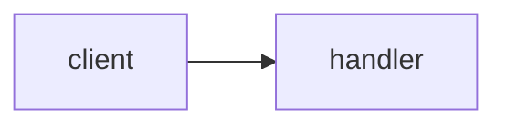

# Explain Plan

An agent proposed a plan; the user cannot judge it because they do not know the code it references. Your job: establish what the referenced code does TODAY, compare that against what the plan claims, and surface where the plan is an assumption rather than a fact. Do not rewrite or improve the plan.

Scope lock: this skill READS the repo and WRITES only the guide file, the scratchpad, and the published page. NEVER modify, fix, or format any file inside the repo, and NEVER start implementing the plan you are explaining.

## Style rules (hard requirements for every sentence you output)

- Mechanism, never category. NOT "it uses a caching strategy". YES "it holds the result in memory for 60s, so the second call skips the DB".
- Name the real thing: file, function, value, error. NOT "the retry logic is unbounded". YES "`fetchUser` never resets `attempts`".
- Gloss every repo-specific or advanced term on first use: "idempotent (running it twice does the same as once)". Each glossed term also becomes a Glossary entry.
- Max 2 sentences per bullet.
- Banned words unless quoting code: leverage, robust, seamless, holistic, paradigm, surface area, first-class, ergonomics, opinionated, orchestrate, architected, non-trivial.

## Step 0 - Repo key and guide

Derive the repo key. It identifies the REPO, not the checkout, so every worktree and clone shares one guide:

```bash
origin=$(git remote get-url origin 2>/dev/null)
if [ -n "$origin" ]; then
  key=$(printf '%s' "$origin" | sed -E 's#^[a-z]+://##; s#^git@##; s#\.git$##; s#[^A-Za-z0-9]+#-#g' | tr 'A-Z' 'a-z')
else
  key=$(basename "$(dirname "$(git rev-parse --path-format=absolute --git-common-dir)")")
fi
echo "$key"
```

If not inside a git repo: tell the user and STOP.

Read `~/.claude/repo-guides/<key>.md` if it exists.
- A component entry is FRESH if `git log -1 --format=%H -- <path>` equals the entry's Stamp hash. Reuse fresh entries without re-deriving them.
- A stale entry (hashes differ) must be re-derived from the current file in Step 2.
- If the guide exists but is unparseable (no `## Components` heading, or truncated mid-entry): rename it to `<key>.md.bak`, start a fresh guide, and tell the user you did so.

## Step 1 - Acquire the plan

Try in order:

1. An argument that is a file path: Read it.
2. Plan text pasted in the user's message: use it.
3. A plan presented earlier in this conversation (by you or another agent): use the most recent one.

If none found: ask the user to paste the plan or give a path, and STOP until they do.

## Step 2 - Map each plan step to code

For every step in the plan:

- Extract the files, functions, classes, endpoints, and tables it names or implies. Grep for each; read the surrounding file IN FULL.
- Record what that code does TODAY, before the plan changes it.
- If a referenced thing does not exist in the repo, that is a MISSING risk flag (Step 3), not an error.
- Reuse fresh guide entries for context instead of re-deriving known components.

## Step 3 - Flag risks

Compare plan claims against code reality. Flag every instance of:

- **MISMATCH** (red): the plan says the code does X; it actually does Y. Quote both the plan line and the code.
- **MISSING** (red): the plan references a file, function, or table that does not exist.
- **IRREVERSIBLE** (red): DB migrations, data deletion, published API contract changes.
- **UNKNOWN** (amber): the step depends on an external API or library behavior that nothing in the repo currently exercises. These are spike candidates: the smallest throwaway script that would prove the assumption.
- **UNTESTED** (amber): the step adds or changes logic with no corresponding test step in the plan.

Then derive **Questions to ask the agent**: 2-3 concrete challenges from the highest-severity flags, phrased so the user can paste them straight back to the agent (e.g. "You say `SessionStore.get` returns null on expiry - it actually throws `TokenExpiredError` (session.ts:88). How does step 3 handle that?").

## Step 4 - Render the page

Read `template.html` from this skill's directory. Replace every `{{TOKEN}}`; change NOTHING else (no restructuring, no CSS edits, no section reordering - consistency across runs is the point). The template IS the page design: do not run design skills or "improve" the page while publishing.

| Token | Content |
|---|---|
| `{{TITLE}}` | what the plan builds, 3-7 plain words (e.g. `Cache invalidation on logout`) - NEVER just the repo name |
| `{{SUBTITLE}}` | `<repo-key> - agent plan - YYYY-MM-DD` |
| `{{TLDR_HTML}}` | one lead `<p>` sentence on what the plan builds plus your verdict on how grounded it is, then a `<ul>` of 2-4 bullets for the key findings |
| `{{PLAN_MERMAID}}` | mermaid `flowchart LR` of plan steps pointing at the files they touch; steps with red flags get `class ... hot`, clean steps `class ... dim`. Include both classDefs: `classDef dim fill:#e5e7eb,stroke:#9ca3af,color:#4b5563` and `classDef hot fill:#dbeafe,stroke:#2563eb,color:#1e3a8a,stroke-width:2px` |
| `{{MAP_ITEMS}}` | one `<details>` block per plan step, shape below |
| `{{RISK_COUNT}}` | number of risk flags |
| `{{RISK_ITEMS}}` | one `<details>` block per flag, shape below |
| `{{QUESTION_ITEMS}}` | `<li>` per question |
| `{{GLOSSARY_ITEMS}}` | `<dt>term</dt><dd>definition</dd>` pairs |

Mermaid safety - a parse failure shows a blank or broken diagram, so these are MUST rules: wrap EVERY node label in double quotes (`S1["Step 1: clearCache on logout"]`); NEVER put `<`, `>`, or `&` anywhere in the diagram source - the HTML parser eats them before mermaid runs (write `Promise of User`, never `Promise<User>`); node ids must be plain letters and digits only.

Map item shape:

```html
<details>
  <summary><strong>Step 2: add rate limiting</strong> <span class="badge amber">1 flag</span> touches <code>src/middleware/</code></summary>
  <ul>
    <li><strong>Code it touches:</strong> ...</li>
    <li><strong>What that code does today:</strong> ...</li>
    <li><strong>What this step changes:</strong> ...</li>
  </ul>
</details>
```

Risk item shape:

```html
<details>
  <summary><span class="badge red">MISMATCH</span> <strong>plan misreads <code>SessionStore.get</code></strong></summary>
  <ul>
    <li><strong>Plan says:</strong> "returns null on expiry"</li>
    <li><strong>Code says:</strong> throws <code>TokenExpiredError</code> (session.ts:88)</li>
    <li><strong>Why it matters:</strong> step 3's null check will never run; expired sessions crash the handler.</li>
  </ul>
</details>
```

Write the filled HTML to the scratchpad, then publish with the Artifact tool: favicon `🗺️` (never change it), title from `{{TITLE}}`. If the Artifact tool is unavailable, write the file to `~/.claude/repo-guides/renders/<key>-<title-slug>.html` and send it with SendUserFile (display: render).

## Step 5 - Update the guide

RE-READ `~/.claude/repo-guides/<key>.md` from disk NOW - an agent in another worktree may have written it since Step 0. Merge: keep entries you did not touch, replace entries you refreshed, append new ones. Then write the whole file.

- Every component you explained gets an entry stamped with `git log -1 --format=%H -- <path>` and today's date.
- Add new glossary terms (skip duplicates). The page turns every mention of a glossary term into a hover tooltip automatically, so keep each definition a single self-contained sentence.
- If `## Overview` is missing or empty, write it now: what the app does, max 5 sentences.

Guide file format:

````markdown
# Repo guide: <key>

Maintained by the explain-pr, explain-plan, and explain-pr-comments skills. This is a cache of understanding; the code is the truth.

Updated: YYYY-MM-DD

## Overview

<max 5 sentences>

## Components

### path/to/file.ts
- What: <one sentence>
- Why it exists: <one sentence>
- Gotchas: <optional, max 2 sentences>
- Stamp: <full commit hash> YYYY-MM-DD

## Flows

### <flow name>


## Glossary

- **term**: one-sentence definition
````

Finish your reply to the user with the artifact link, the risk count, and one line noting the guide was updated.
