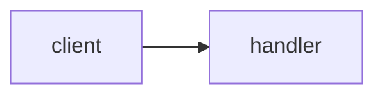

# Explain PR Comments

A PR has review comments the user cannot confidently judge because they do not know the code being discussed. Your job: for every unresolved comment, establish what the reviewer is claiming, what the code actually does, and whether the claim holds. The user decides what to do; you supply the evidence.

Scope lock: this skill READS the repo and GitHub, and WRITES only the guide file, the scratchpad, and the published page. NEVER modify, fix, or format any file in the repo, and NEVER reply to, resolve, or react to any comment on GitHub.

## Style rules (hard requirements for every sentence you output)

- Mechanism, never category. NOT "it uses a caching strategy". YES "it holds the result in memory for 60s, so the second call skips the DB".
- Name the real thing: file, function, value, error. NOT "the retry logic is unbounded". YES "`fetchUser` never resets `attempts`".
- Gloss every repo-specific or advanced term on first use: "idempotent (running it twice does the same as once)". Each glossed term also becomes a Glossary entry.
- Max 2 sentences per bullet.
- Banned words unless quoting a comment or code: leverage, robust, seamless, holistic, paradigm, surface area, first-class, ergonomics, opinionated, orchestrate, architected, non-trivial.

## Step 0 - Repo key and guide

Derive the repo key. It identifies the REPO, not the checkout, so every worktree and clone shares one guide:

```bash
origin=$(git remote get-url origin 2>/dev/null)
if [ -n "$origin" ]; then
  key=$(printf '%s' "$origin" | sed -E 's#^[a-z]+://##; s#^git@##; s#\.git$##; s#[^A-Za-z0-9]+#-#g' | tr 'A-Z' 'a-z')
else
  key=$(basename "$(dirname "$(git rev-parse --path-format=absolute --git-common-dir)")")
fi
echo "$key"
```

If not inside a git repo: tell the user and STOP.

Read `~/.claude/repo-guides/<key>.md` if it exists.
- A component entry is FRESH if `git log -1 --format=%H -- <path>` equals the entry's Stamp hash. Reuse fresh entries without re-deriving them.
- A stale entry (hashes differ) must be re-derived from the current file in Step 2.
- If the guide exists but is unparseable (no `## Components` heading, or truncated mid-entry): rename it to `<key>.md.bak`, start a fresh guide, and tell the user you did so.

## Step 1 - Acquire the comments

1. PR number: from the user's argument, else `gh pr view --json number --jq .number` for the current branch. If neither works, ask for the PR number and STOP until given.
2. Owner and repo: `gh repo view --json owner,name --jq '"\(.owner.login) \(.name)"'`.
3. Fetch review threads (line-anchored discussions; this is where humans AND AI reviewers like Cubic and Copilot post):

```bash
gh api graphql -f query='
query($o:String!,$r:String!,$n:Int!){
  repository(owner:$o,name:$r){
    pullRequest(number:$n){
      reviewThreads(first:100){
        nodes{
          isResolved isOutdated path line
          comments(first:50){nodes{author{login} body diffHunk}}
        }
      }
    }
  }
}' -f o=<owner> -f r=<repo> -F n=<pr-number>
```

4. Also fetch the PR's intent and top-level conversation comments: `gh pr view <n> --json title,body,comments`. The title and body are REQUIRED context - a comment only makes sense against what the PR is trying to do.
5. Filter:
   - DROP threads where `isResolved` is true.
   - DROP pure status noise: CI results, coverage percentages, deploy previews, "LGTM"-only comments with no claim about the code.
   - KEEP everything else regardless of author - human reviewers and AI reviewers (Cubic, Copilot) are treated identically.
   - KEEP threads where `isOutdated` is true, but mark them OUTDATED (the code under them has since changed; re-check against current code).
   - `line` can be null (file-level comment) - handle it, do not crash or skip.

If zero comments survive the filter: tell the user there is nothing unresolved and STOP.

If `gh` is missing or unauthenticated: say exactly what failed and STOP - there is no offline source for comments.

## Step 2 - Ground each comment in the code

For every surviving comment:

- Read the file it targets IN FULL at the current HEAD, not just the `diffHunk`. NEVER judge a comment from the hunk alone.
- Establish the bigger picture FIRST: what role this file/function plays in the system (what flow it sits in, who calls it), what the PR is trying to do here (from the PR title/body), and which part of that the comment is actually about. The repo guide's Overview and Flows are your first source; derive from code when the guide is silent.
- Establish what that code does TODAY. For OUTDATED threads, note what changed since the comment.
- Grep callers when the comment claims blast-radius effects ("this breaks X") - verify who actually calls it.
- Reuse fresh guide entries for context instead of re-deriving known components.
- Collect repo-specific terms for the Glossary.

## Step 3 - Verdicts

Give every comment exactly one verdict, judged against the code you read:

- **GROUNDED** (red badge): the code confirms the reviewer's claim. State the evidence (file, line, what the code does). Note what acting on it would involve - scope only, not a drafted reply.
- **YOUR CALL** (amber badge): a real tradeoff or style/design preference where both sides have merit. State both sides and what each costs. These comments ALSO become entries in the "Needs your call" section.
- **MISTAKEN** (green badge): the comment misreads the code. Quote the code that contradicts it.

Never soften a verdict to be polite, and never mark GROUNDED without naming the confirming evidence.

**Needs your call** section: one entry per YOUR CALL comment - the decision in one line, the options, what each option costs. This is the part the user must actually think about.

## Step 4 - Render the page

Read `template.html` from this skill's directory. Replace every `{{TOKEN}}`; change NOTHING else (no restructuring, no CSS edits, no section reordering - consistency across runs is the point). The template IS the page design: do not run design skills or "improve" the page while publishing.

| Token | Content |
|---|---|
| `{{TITLE}}` | what the review is about, 3-7 plain words (e.g. `Tenant isolation review pushback`) - NEVER just the repo name and number |
| `{{SUBTITLE}}` | `<repo-key> - PR <n> comments - YYYY-MM-DD` |
| `{{TLDR_HTML}}` | one lead `<p>` sentence stating what the PR is trying to do and what the review conversation is about, then a `<ul>` of 2-4 bullets including the verdict counts (e.g. "5 grounded, 2 your call, 1 mistaken") |
| `{{COMMENT_COUNT}}` | number of comment entries |
| `{{COMMENT_ITEMS}}` | one `<details>` block per comment, shape below |
| `{{CALL_COUNT}}` | number of needs-your-call entries |
| `{{CALL_ITEMS}}` | one `<details>` block per decision, shape below |
| `{{GLOSSARY_ITEMS}}` | `<dt>term</dt><dd>definition</dd>` pairs |

Comment item shape (add `<span class="badge amber">outdated</span>` after the verdict badge when the thread is outdated):

Every comment item MUST open with a "Bigger picture" bullet that a reader with zero repo knowledge can follow: the code's role in the system, what the PR is doing to it, and which part of that this comment targets.

```html
<details>
  <summary><code>session.ts:88</code> <span class="badge red">grounded</span> cubic-ai: expired sessions crash the handler</summary>
  <ul>
    <li><strong>Bigger picture:</strong> <code>SessionStore</code> is how every authenticated request looks up who is logged in; this PR makes handlers fetch sessions directly instead of via middleware. The comment is about what happens when the session being fetched has expired.</li>
    <li><strong>Reviewer says:</strong> "SessionStore.get throws on expiry but the caller expects null."</li>
    <li><strong>The code today:</strong> <code>SessionStore.get</code> raises <code>TokenExpiredError</code> (session.ts:88); the caller at handlers.ts:41 only checks for null.</li>
    <li><strong>Verdict:</strong> Grounded - the unhandled error path is real and reachable on any expired session.</li>
    <li><strong>Acting on it involves:</strong> a try/catch or a null-returning wrapper at one call site.</li>
  </ul>
</details>
```

Needs-your-call item shape:

```html
<details>
  <summary><strong>Per-IP or per-user rate limiting</strong> <span class="badge amber">your call</span></summary>
  <ul>
    <li><strong>The decision:</strong> The reviewer wants the limiter keyed per user; the PR keys per IP.</li>
    <li><strong>Option A - keep per IP:</strong> Simpler, no auth dependency; one office NAT can exhaust a shared budget.</li>
    <li><strong>Option B - switch to per user:</strong> Fairer for shared IPs; unauthenticated routes need a fallback key anyway.</li>
  </ul>
</details>
```

Publish the page, adapting to whatever harness you are running in:

1. If an Artifact-publishing tool exists in this session (Claude Code): write the filled HTML to a scratch file and publish it with favicon `💬` (never change it) and title from `{{TITLE}}`.
2. Otherwise (Codex or any other harness): write the filled HTML to `~/.claude/repo-guides/renders/<key>-<title-slug>.html`, then surface it - send it as a rendered file if a file-sending tool exists, else run `open <path>` (macOS) and print the path.

## Step 5 - Update the guide

RE-READ `~/.claude/repo-guides/<key>.md` from disk NOW - an agent in another worktree may have written it since Step 0. Merge: keep entries you did not touch, replace entries you refreshed, append new ones. Then write the whole file.

- Every component you explained gets an entry stamped with `git log -1 --format=%H -- <path>` and today's date.
- Add new glossary terms (skip duplicates). The page turns every mention of a glossary term into a hover tooltip automatically, so keep each definition a single self-contained sentence.
- If `## Overview` is missing or empty, write it now: what the app does, max 5 sentences.

Guide file format:

````markdown
# Repo guide: <key>

Maintained by the explain-pr, explain-plan, and explain-pr-comments skills. This is a cache of understanding; the code is the truth.

Updated: YYYY-MM-DD

## Overview

<max 5 sentences>

## Components

### path/to/file.ts
- What: <one sentence>
- Why it exists: <one sentence>
- Gotchas: <optional, max 2 sentences>
- Stamp: <full commit hash> YYYY-MM-DD

## Flows

### <flow name>


## Glossary

- **term**: one-sentence definition
````

Finish your reply to the user with the artifact link, the verdict counts, and one line noting the guide was updated.
