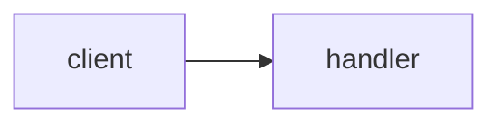

# Explain PR

Explain someone else's change to a reader who has ZERO knowledge of this repo but is a competent engineer. This is understanding, not judgment: do not review, praise, or criticize the code. Explain it.

Scope lock: this skill READS the repo and WRITES only the guide file, the scratchpad, and the published page. NEVER modify, fix, or format any file inside the repo, even if you notice a bug while reading.

## Style rules (hard requirements for every sentence you output)

- Mechanism, never category. NOT "it uses a caching strategy". YES "it holds the result in memory for 60s, so the second call skips the DB".
- Name the real thing: file, function, value, error. NOT "the retry logic is unbounded". YES "`fetchUser` never resets `attempts`".
- Gloss every repo-specific or advanced term on first use: "idempotent (running it twice does the same as once)". Each glossed term also becomes a Glossary entry.
- Max 2 sentences per bullet.
- Banned words unless quoting code: leverage, robust, seamless, holistic, paradigm, surface area, first-class, ergonomics, opinionated, orchestrate, architected, non-trivial.

## Step 0 - Repo key and guide

Derive the repo key. It identifies the REPO, not the checkout, so every worktree and clone shares one guide:

```bash
origin=$(git remote get-url origin 2>/dev/null)
if [ -n "$origin" ]; then
  key=$(printf '%s' "$origin" | sed -E 's#^[a-z]+://##; s#^git@##; s#\.git$##; s#[^A-Za-z0-9]+#-#g' | tr 'A-Z' 'a-z')
else
  key=$(basename "$(dirname "$(git rev-parse --path-format=absolute --git-common-dir)")")
fi
echo "$key"
```

If not inside a git repo: tell the user and STOP.

Read `~/.claude/repo-guides/<key>.md` if it exists.
- A component entry is FRESH if `git log -1 --format=%H -- <path>` equals the entry's Stamp hash. Reuse fresh entries without re-deriving them.
- A stale entry (hashes differ) must be re-derived from the current file in Step 2.
- If the guide exists but is unparseable (no `## Components` heading, or truncated mid-entry): rename it to `<key>.md.bak`, start a fresh guide, and tell the user you did so.

## Step 1 - Acquire the diff

Try in order, stop at the first that returns content:

1. PR number or URL given: `gh pr diff <n>`. If `gh` fails (missing, unauthenticated), say so in one line and continue down the ladder.
2. Branch: `default=$(git symbolic-ref --short refs/remotes/origin/HEAD 2>/dev/null | sed 's#^origin/##'); git diff ${default:-main}...HEAD`
3. Working tree: `git diff HEAD`

If all are empty: state "No changes found" and STOP.

## Step 2 - Deep read

- Read every touched file IN FULL. NEVER explain a hunk in isolation.
- If the diff exceeds 800 changed lines: fully explain the 10 files with the largest blast radius (auth, money, data, shared utilities first) and give every remaining file a one-line summary in the component list. Say in the TL;DR that you triaged.
- For every changed or new function/class, grep the repo for its callers. Blast radius = who calls this and what happens to them if it misbehaves.
- Collect every repo-specific term you had to figure out while reading; they become Glossary entries.
- Reuse fresh guide entries for context instead of re-deriving known components.

## Step 3 - Build the explanation

Produce these five pieces, obeying the style rules:

1. **TL;DR**: one plain-language lead sentence saying what this PR does, then 2-4 bullets covering the distinct things it changes. Max 2 sentences per bullet.
2. **Flow diagram**: mermaid `flowchart LR` of the affected path. Unchanged steps get `class ... dim`, new or modified steps get `class ... hot`. Include both classDefs:
   `classDef dim fill:#e5e7eb,stroke:#9ca3af,color:#4b5563` and `classDef hot fill:#dbeafe,stroke:#2563eb,color:#1e3a8a,stroke-width:2px`.
   If the change has no meaningful flow (pure config, docs), diagram the smallest surrounding process it affects.
   Mermaid safety - a parse failure shows a blank or broken diagram, so these are MUST rules: wrap EVERY node label in double quotes (`A["fetchUser(id)"]`, including inside shape brackets like `E[("db.query")]`); NEVER put `<`, `>`, or `&` anywhere in the diagram source - the HTML parser eats them before mermaid runs (write `Promise of User`, never `Promise<User>`); node ids must be plain letters and digits only.
3. **Component breakdown**: one entry per touched file with exactly these four bullets: What it is / Why it exists / What this change does to it / If this change is wrong, what breaks. Assign a severity badge: red (data loss, auth, money, migrations), amber (user-visible behavior), green (internal, low blast radius). Mark newly created files with a NEW badge.
4. **Worth a closer look**: 2-4 items naming the biggest design decisions or tradeoffs this diff makes - the places a reviewer should actually spend time. Each item: what was decided, why it matters, and exactly where to look (file and function). These must come from THIS diff, not a generic checklist. Severity badge by consequence-if-wrong: red, amber, or green.
5. **Glossary**: every term you glossed, defined in one sentence each. The page turns every mention of a glossary term into a hover tooltip automatically, so keep each definition a single self-contained sentence.

## Step 4 - Render the page

Read `template.html` from this skill's directory. Replace every `{{TOKEN}}`; change NOTHING else (no restructuring, no CSS edits, no section reordering - consistency across runs is the point). The template IS the page design: do not run design skills or "improve" the page while publishing.

| Token | Content |
|---|---|
| `{{TITLE}}` | `<repo-key> PR <n>` or `<repo-key> <branch>` |
| `{{TLDR_HTML}}` | one lead `<p>` sentence, then a `<ul>` of 2-4 bullets |
| `{{FLOW_MERMAID}}` | the mermaid source from Step 3.2 |
| `{{COMPONENT_COUNT}}` | number of component entries |
| `{{COMPONENT_ITEMS}}` | one `<details>` block per file, shape below |
| `{{HOTSPOT_COUNT}}` | number of closer-look items |
| `{{HOTSPOT_ITEMS}}` | one `<details>` block per item, shape below |
| `{{GLOSSARY_ITEMS}}` | `<dt>term</dt><dd>definition</dd>` pairs |

Component `<details>` shape:

```html
<details>
  <summary><code>src/middleware/rate_limiter.ts</code> <span class="badge new">NEW</span> <span class="badge amber">medium</span> counts requests per IP</summary>
  <ul>
    <li><strong>What it is:</strong> ...</li>
    <li><strong>Why it exists:</strong> ...</li>
    <li><strong>What this change does:</strong> ...</li>
    <li><strong>If this is wrong:</strong> ...</li>
  </ul>
</details>
```

Closer-look item shape:

```html
<details>
  <summary><strong>Rate limiting counts per IP, not per user</strong> <span class="badge amber">tradeoff</span></summary>
  <ul>
    <li><strong>What was decided:</strong> The limiter keys on request IP, so all users behind one office NAT share a budget.</li>
    <li><strong>Why it matters:</strong> A large customer on one egress IP can lock themselves out under normal use.</li>
    <li><strong>Where to look:</strong> <code>rate_limiter.ts</code>, the key expression in <code>bucketFor()</code>.</li>
  </ul>
</details>
```

Write the filled HTML to the scratchpad, then publish with the Artifact tool: favicon `🔍` (never change it), title from `{{TITLE}}`. If the Artifact tool is unavailable, write the file to `~/.claude/repo-guides/renders/<key>-<title-slug>.html` and send it with SendUserFile (display: render).

## Step 5 - Update the guide

RE-READ `~/.claude/repo-guides/<key>.md` from disk NOW - an agent in another worktree may have written it since Step 0. Merge: keep entries you did not touch, replace entries you refreshed, append new ones. Then write the whole file.

- Every component you explained gets an entry stamped with `git log -1 --format=%H -- <path>` and today's date.
- Add new glossary terms (skip duplicates).
- Add or update the flow diagram you drew, under a stable name (e.g. "api request path").
- If `## Overview` is missing or empty, write it now: what the app does, max 5 sentences.

Guide file format:

````markdown
# Repo guide: <key>

Maintained by the explain-pr and explain-plan skills. This is a cache of understanding; the code is the truth.

Updated: YYYY-MM-DD

## Overview

<max 5 sentences>

## Components

### path/to/file.ts
- What: <one sentence>
- Why it exists: <one sentence>
- Gotchas: <optional, max 2 sentences>
- Stamp: <full commit hash> YYYY-MM-DD

## Flows

### <flow name>


## Glossary

- **term**: one-sentence definition
````

Finish your reply to the user with the artifact link and one line noting the guide was updated.
