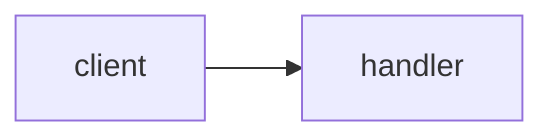

# Explain PR

Explain someone else's change to a reader who has ZERO knowledge of this repo but is a competent engineer. This is understanding, not judgment: do not review, praise, or criticize the code. Explain it.

Scope lock: this skill READS the repo and WRITES only the guide file, the scratchpad, and the published page. NEVER modify, fix, or format any file inside the repo, even if you notice a bug while reading.

## Style rules (hard requirements for every sentence you output)

- Mechanism, never category. NOT "it uses a caching strategy". YES "it holds the result in memory for 60s, so the second call skips the DB".
- Name the real thing: file, function, value, error. NOT "the retry logic is unbounded". YES "`fetchUser` never resets `attempts`".
- Gloss every repo-specific or advanced term on first use: "idempotent (running it twice does the same as once)". Each glossed term also becomes a Glossary entry.
- Max 2 sentences per bullet.
- Banned words unless quoting code: leverage, robust, seamless, holistic, paradigm, surface area, first-class, ergonomics, opinionated, orchestrate, architected, non-trivial.

## Step 0 - Repo key and guide

Derive the repo key. It identifies the REPO, not the checkout, so every worktree and clone shares one guide:

```bash
origin=$(git remote get-url origin 2>/dev/null)
if [ -n "$origin" ]; then
  key=$(printf '%s' "$origin" | sed -E 's#^[a-z]+://##; s#^git@##; s#\.git$##; s#[^A-Za-z0-9]+#-#g' | tr 'A-Z' 'a-z')
else
  key=$(basename "$(dirname "$(git rev-parse --path-format=absolute --git-common-dir)")")
fi
echo "$key"
```

If not inside a git repo: tell the user and STOP.

Read `~/.claude/repo-guides/<key>.md` if it exists.
- A component entry is FRESH if `git log -1 --format=%H -- <path>` equals the entry's Stamp hash. Reuse fresh entries without re-deriving them.
- A stale entry (hashes differ) must be re-derived from the current file in Step 2.
- If the guide exists but is unparseable (no `## Components` heading, or truncated mid-entry): rename it to `<key>.md.bak`, start a fresh guide, and tell the user you did so.

## Step 1 - Acquire the diff

Try in order, stop at the first that returns content:

1. PR number or URL given: `gh pr diff <n>`. If `gh` fails (missing, unauthenticated), say so in one line and continue down the ladder.
2. Branch: `default=$(git symbolic-ref --short refs/remotes/origin/HEAD 2>/dev/null | sed 's#^origin/##'); git diff ${default:-main}...HEAD`
3. Working tree: `git diff HEAD`

If all are empty: state "No changes found" and STOP.

## Step 2 - Deep read

- Read every touched file IN FULL. NEVER explain a hunk in isolation.
- If the diff exceeds 800 changed lines: walk the mechanisms of the highest-blast-radius changes fully (auth, money, data, shared utilities first) and cover the rest with shorter walkthroughs and no code excerpts. Say in the TL;DR that you triaged.
- For every changed or new function/class, grep the repo for its callers. Blast radius = who calls this and what happens to them if it misbehaves.
- Collect every repo-specific term you had to figure out while reading; they become Glossary entries.
- Reuse fresh guide entries for context instead of re-deriving known components.

## Step 3 - Build the explanation

Produce these five pieces, obeying the style rules:

1. **TL;DR**: one plain-language lead sentence saying what this PR does, then 2-4 bullets covering the distinct things it changes. Max 2 sentences per bullet.
2. **Flow diagram**: mermaid `flowchart LR` of the affected path. Unchanged steps get `class ... dim`, new or modified steps get `class ... hot`. Include both classDefs:
   `classDef dim fill:#e5e7eb,stroke:#9ca3af,color:#4b5563` and `classDef hot fill:#dbeafe,stroke:#2563eb,color:#1e3a8a,stroke-width:2px`.
   If the change has no meaningful flow (pure config, docs), diagram the smallest surrounding process it affects.
   Mermaid safety - a parse failure shows a blank or broken diagram, so these are MUST rules: wrap EVERY node label in double quotes (`A["fetchUser(id)"]`, including inside shape brackets like `E[("db.query")]`); NEVER put `<`, `>`, or `&` anywhere in the diagram source - the HTML parser eats them before mermaid runs (write `Promise of User`, never `Promise<User>`); node ids must be plain letters and digits only.
3. **The changes**: group the WHOLE diff into 2-5 coherent changes. A change is one thing the PR does that fits in a sentence ("adds rate limiting to the users API") and usually spans several files - never organize by file. Every hunk belongs to exactly one change; fold mechanical hunks (requires, wiring, renames) into the change that needed them. Per change:
   - A behavior-named title, a one-line gist, and a severity badge: red (data loss, auth, money, migrations), amber (user-visible behavior), green (internal). Add a NEW badge when the capability did not exist before.
   - The mechanism as control flow with real names and values: what happens now when this code runs, and what happened before wherever the difference matters. This is the heart of the page - concrete narrative, not summary.
   - 1-3 verbatim code excerpts, max 10 lines each, each opening with a `// file:line` comment line. Pick the lines that carry the mechanism, never boilerplate.
   - One closing line listing every file this change touches.
4. **Decisions**: 2-4 decision records for the choices in this diff that a competent engineer could have made differently. Per decision: **Chose** X **over** Y (always name the rejected alternative - a decision is only visible next to what it beat) / **You gain** / **You pay** / **Breaks down when** (the concrete condition that makes this choice wrong) / **Sit with this** (one pointed question that tests the decision against THIS system's reality). These must come from THIS diff, not a generic checklist.
5. **Glossary**: every term you glossed, defined in one sentence each. The page turns every mention of a glossary term into a hover tooltip automatically, so keep each definition a single self-contained sentence.

## Step 4 - Render the page

Read `template.html` from this skill's directory. Replace every `{{TOKEN}}`; change NOTHING else (no restructuring, no CSS edits, no section reordering - consistency across runs is the point). The template IS the page design: do not run design skills or "improve" the page while publishing.

| Token | Content |
|---|---|
| `{{TITLE}}` | what the PR does, 3-7 plain words (e.g. `Resource Viewer storage and delivery`) - NEVER just the repo name and number |
| `{{SUBTITLE}}` | `<repo-key> - PR <n>` (or branch) `- YYYY-MM-DD` |
| `{{TLDR_HTML}}` | one lead `<p>` sentence, then a `<ul>` of 2-4 bullets |
| `{{FLOW_MERMAID}}` | the mermaid source from Step 3.2 |
| `{{CHANGE_COUNT}}` | number of change entries |
| `{{CHANGE_ITEMS}}` | one `<details>` block per change, shape below |
| `{{DECISION_COUNT}}` | number of decision records |
| `{{DECISION_ITEMS}}` | one `<details>` block per decision, shape below |
| `{{GLOSSARY_ITEMS}}` | `<dt>term</dt><dd>definition</dd>` pairs |

Change `<details>` shape (prose paragraphs, then excerpts, then the file list):

```html
<details>
  <summary><strong>Rate limiting on /api/users</strong> <span class="badge new">NEW</span> <span class="badge amber">medium</span> 20 req/min per IP, then HTTP 429</summary>
  <p>Every request to <code>/api/users</code> now runs through <code>RateLimiter.check</code> before the handler. <code>bucketFor(req.ip)</code> returns a counter that resets every 60 seconds; past 20 hits the middleware answers 429 and the handler never runs.</p>
  <p>Before this PR nothing counted requests - any client could call the endpoint in a loop.</p>
  <pre>// src/middleware/rate_limiter.ts:12
const hits = bucketFor(req.ip).increment()
if (hits > LIMIT) return res.status(429).send("slow down")</pre>
  <p class="files">Files: <code>src/middleware/rate_limiter.ts</code>, <code>src/api/users.ts</code>, <code>src/config.ts</code></p>
</details>
```

Decision record shape ("Sit with this" always last, always `class="sit"`):

```html
<details>
  <summary><strong>Limiter keys on IP, not user</strong> <span class="badge amber">decision</span></summary>
  <ul>
    <li><strong>Chose:</strong> keying the limiter on <code>req.ip</code> over the session's user id.</li>
    <li><strong>You gain:</strong> unauthenticated routes are covered, and no session lookup runs per request.</li>
    <li><strong>You pay:</strong> everyone behind one office NAT shares a single 20 req/min budget.</li>
    <li><strong>Breaks down when:</strong> a big customer's whole office egresses one IP and legitimately exceeds the limit.</li>
    <li class="sit"><strong>Sit with this:</strong> do our largest customers hit this API from shared corporate IPs today?</li>
  </ul>
</details>
```

Publish the page, adapting to whatever harness you are running in:

1. If an Artifact-publishing tool exists in this session (Claude Code): write the filled HTML to a scratch file and publish it with favicon `🔍` (never change it) and title from `{{TITLE}}`.
2. Otherwise (Codex or any other harness): write the filled HTML to `~/.claude/repo-guides/renders/<key>-<title-slug>.html`, then surface it - send it as a rendered file if a file-sending tool exists, else run `open <path>` (macOS) and print the path.

## Step 5 - Update the guide

RE-READ `~/.claude/repo-guides/<key>.md` from disk NOW - an agent in another worktree may have written it since Step 0. Merge: keep entries you did not touch, replace entries you refreshed, append new ones. Then write the whole file.

- Every component you explained gets an entry stamped with `git log -1 --format=%H -- <path>` and today's date.
- Add new glossary terms (skip duplicates).
- Add or update the flow diagram you drew, under a stable name (e.g. "api request path").
- If `## Overview` is missing or empty, write it now: what the app does, max 5 sentences.

Guide file format:

````markdown
# Repo guide: <key>

Maintained by the explain-pr, explain-plan, and explain-pr-comments skills. This is a cache of understanding; the code is the truth.

Updated: YYYY-MM-DD

## Overview

<max 5 sentences>

## Components

### path/to/file.ts
- What: <one sentence>
- Why it exists: <one sentence>
- Gotchas: <optional, max 2 sentences>
- Stamp: <full commit hash> YYYY-MM-DD

## Flows

### <flow name>

```mermaid
flowchart LR
  A[client] --> B[handler]
```

## Glossary

- **term**: one-sentence definition
````

Finish your reply to the user with the artifact link and one line noting the guide was updated.
